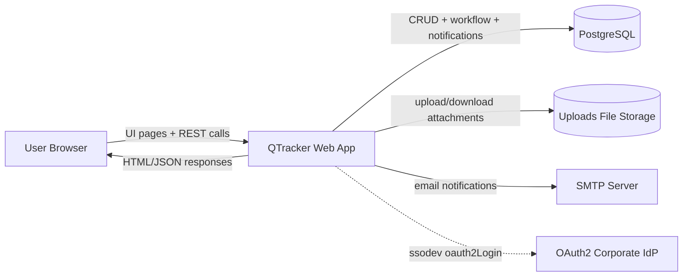
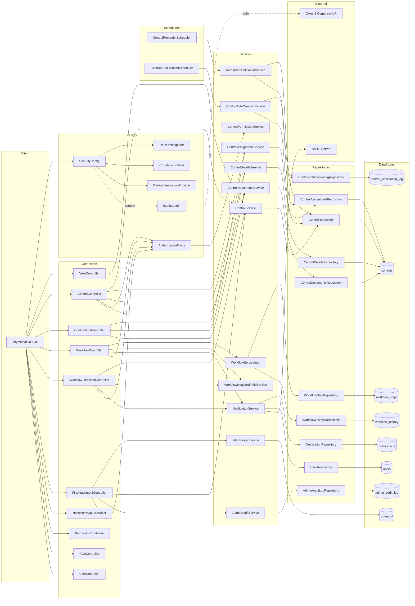

# Data Flow Diagram

## Overview
This document describes the actual data flows implemented in QTracker.

Scope is based on repository code:
- Controllers in `com.kpmg.qtracker.controller`
- Services in `com.kpmg.qtracker.service`
- Repositories in `com.kpmg.qtracker.repository`
- Security chains in `SecurityConfig`
- Schedulers in `com.kpmg.qtracker.scheduler`
- Database schema in Flyway migrations (`V1__init_schema.sql`, `V2__seed_initial_admin.sql`)

## DFD Level 0

## DFD Level 1

## Flow Descriptions

### 1. User Request Flow (UI/API)
1. User actions in Thymeleaf UI call MVC routes and REST endpoints.
2. Requests pass through security chain (`SecurityConfig`) and filters (`RateLimitingFilter`, `CorrelationIdFilter`).
3. Controllers delegate business logic to services.
4. Services use repositories for persistence.
5. Responses return as HTML (views) or JSON (APIs).

### 2. Control CRUD Flow
1. `ControlController` and `ControlTabsController` accept control-related requests.
2. `AuthorizationPolicy` + `ControlPermissionService` enforce access.
3. `ControlService`, `ControlAssignmentService`, `ControlDetailsService`, `ControlDocumentsService` process updates.
4. Repositories persist mainly into `controls` (single-table projections for control, assignment, details, documents).

### 3. Workflow Transition Flow
1. Workflow actions enter via `WorkflowController` and `WorkflowTransitionController`.
2. Required fields are checked by `WorkflowRequiredFieldService`.
3. Workflow state and status changes are handled by `WorkflowServiceImpl` and `ControlService`.
4. History is stored through `WorkflowHistoryRepository` into `workflow_history`.
5. Current workflow steps are managed through `WorkflowStepRepository` into `workflow_steps`.
6. `NotificationService` emits in-app notifications and optional email.

### 4. File Upload/Download Flow
1. `FileAttachmentController` handles upload/view/download/delete endpoints.
2. Access is validated by `AuthorizationPolicy`.
3. Binary files are read/written by `FileStorageService` to `uploads` storage.
4. Attachment metadata is saved in `controls` fields (`attachment_details_path`, `attachment_documents_path`).
5. Administrative file actions can be recorded by `AdminAuditService` into `admin_audit_log`.

### 5. Notification and Reminder Flow
1. Scheduler `ControlReminderScheduler` triggers `ReminderNotificationService` daily.
2. Candidate controls are selected through `ControlRepository` queries.
3. Reminder/overdue rules are evaluated using working-day logic.
4. `NotificationService` writes notifications to `notifications` and can send email via SMTP.
5. Deduplication is tracked in `control_notification_log` via `ControlNotificationLogRepository`.

### 6. Auto-Creation Scheduler Flow
1. `ControlAutoCreationScheduler` runs daily.
2. `ControlAutoCreationService` reads due assignments via `ControlAssignmentRepository`.
3. New control occurrence and assignment are created via `ControlRepository` and `ControlAssignmentRepository`.
4. Auto-created notification is sent through `NotificationService`.

### 7. OAuth2 Login Flow (ssodev)
1. In `ssodev` profile, `SecurityConfig` enables `oauth2Login()`.
2. Browser is redirected to corporate IdP for authentication.
3. After successful callback, request proceeds as authenticated in Spring Security context.
4. Protected routes (`/api/**` and other authenticated endpoints) become available.

## Data Stores

### Primary Database Tables
From Flyway `V1__init_schema.sql`:
- `users`
- `controls`
- `workflow_steps`
- `workflow_history`
- `notifications`
- `control_notification_log`
- `admin_audit_log`

### Non-DB Data Stores
- Filesystem attachment store: configured by `file.upload.dir` and managed by `FileStorageService`.
- HTTP session state: user context used by controllers and security logic.

### Notes on Table Usage
- `controls` is used by multiple entity mappings (`Control`, `ControlAssignment`, `ControlDetails`, `ControlDocuments`).
- Notification dedupe for scheduled jobs is persisted in `control_notification_log`.
- Workflow traceability is split between `workflow_steps` (state) and `workflow_history` (audit trail).