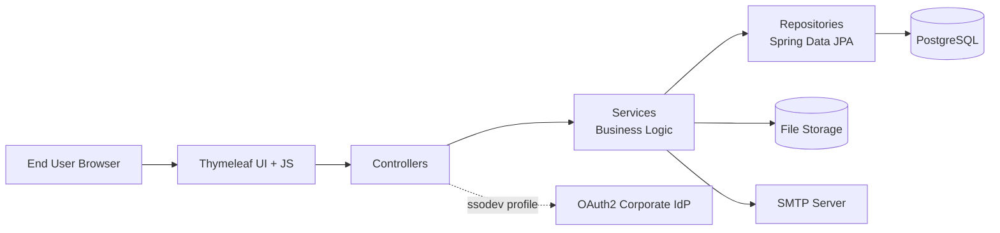

# Solution Architecture (SDLC Compliant)

System: QTracker  
Document Owner: Developer (R)  
Last Updated: 2026-04-01  
SDLC Reference: Architecture, Data Flow, Security, Environment Segmentation (Sections 3-5)

## 1. Overview
QTracker is an internal Spring Boot application for control lifecycle management, workflow transitions, notifications, reminders, and file attachments.

Architecture style: modular monolith with layered segmentation:
Presentation -> Business -> Persistence -> Infrastructure.

Tech stack (from repository code):
- Java 25
- Spring Boot 3.5.7 (Web, Thymeleaf, JPA, Security, Validation, Actuator, Mail)
- PostgreSQL 17 + Flyway
- Docker / Docker Compose
- Apache POI (Excel export)

## 2. Architecture Diagram

## 3. Environment Model (SDLC Requirement)
SDLC requires environment segmentation and isolated configuration.

| Environment | Purpose | Config |
|---|---|---|
| dev | Local development | application-dev.yml |
| stage | UAT / pre-production verification | application-stage.yml |
| prod | Production runtime | application-prod.yml |
| ssodev | Security profile for OAuth2 login path | Spring profile (`SecurityConfig`) |

Implementation notes from repository:
- Runtime secrets are sourced from environment variables in application config.
- Docker Compose separates app and database services.

## 4. Security Architecture (SDLC / ISS)
SDLC requires documented security controls, roles, and secure engineering principles.

### Authentication
- `dev`: form login via Spring Security (`formLogin`) with `DevAuthenticationProvider`.
- `ssodev`: OAuth2 login enabled in `SecurityConfig`.

### Authorization
- RBAC roles in domain and APIs: `FACILITATOR`, `CONTROL_OPERATOR`, `SOQM_LEAD`, `PROCESS_OWNER`, `ADMIN`.
- Fine-grained access checks implemented in `AuthorizationPolicy` and `ControlPermissionService`.

### Protection Controls
- CSRF enabled with cookie repository; explicit exclusions configured for API paths.
- Rate limiting filter: `RateLimitingFilter`.
- Login lockout protection: `LoginAttemptService`.
- Security headers configured in `SecurityConfig` (HSTS, CSP, frame options, content-type options, referrer policy, permissions policy, XSS header).
- BCrypt password encoder via `PasswordConfig`.
- DTO and request validation via Spring Validation.

### Data Protection
- File name and folder sanitization in `FileStorageService`.
- Correlation ID propagation via `CorrelationIdFilter`.
- Session fixation migration enabled in security session management.

## 5. Layers

### 5.1 Presentation Layer
- Thymeleaf templates + static assets.
- MVC and REST controllers handle user and API endpoints.
- Request parsing and validation at controller boundary.

### 5.2 Business Layer
- Domain logic for controls, workflow transitions, reminders, and notifications.
- Multi-step orchestration through service composition.
- Action-level authorization through `AuthorizationPolicy`.

### 5.3 Persistence Layer
- Spring Data JPA repositories with JPQL and native queries.
- Entity model backed by Flyway-managed schema.
- Performance-oriented query methods for reminders and dashboard use cases.

### 5.4 Infrastructure Layer
- Spring Security filter chains and custom filters.
- Scheduler jobs (`@Scheduled`) for reminders and auto-creation.
- SMTP channel integration.
- Filesystem storage for attachments.
- Exception handling and operational logging.

## 6. Components

### 6.1 Presentation and API
- UI/MVC: `ViewController`, `AuthController`.
- Controls: `ControlController`, `ControlTabsController`.
- Workflow: `WorkflowController`, `WorkflowTransitionController`, `WorkflowApiController`.
- Dashboard/Performance: `DashboardController`, `MyDashboardController`, `DashboardDeadlineController`, `PerformanceController`.
- Notifications: `NotificationApiController`.
- Attachments: `FileAttachmentController`.
- Access metadata: `UserController`, `RoleController`, `PermissionController`.

### 6.2 Services
- Control domain: `ControlService`, `ControlDetailsService`, `ControlAssignmentService`, `ControlDocumentsService`, `ControlHistoryService`.
- Workflow: `WorkflowServiceImpl`, `WorkflowRequiredFieldService`, `AuthorizationPolicy`.
- Notifications/reminders: `NotificationService`, `NotificationTemplateService`, `ReminderNotificationService`, frequency services.
- Files: `FileStorageService`.
- Audit: `AdminAuditService`.

### 6.3 Repositories
- Users: `UserRepository`.
- Controls: `ControlRepository`, `ControlAssignmentRepository`, `ControlDetailsRepository`, `ControlDocumentsRepository`.
- Workflow: `WorkflowStepRepository`, `WorkflowHistoryRepository`.
- Notifications: `NotificationRepository`, `ControlNotificationLogRepository`.
- Audit: `AdminAuditLogRepository`.

### 6.4 Schedulers
- `ControlReminderScheduler`.
- `ControlAutoCreationScheduler`.
- Frequency-based schedulers: monthly, quarterly, semi-annual, annual, recurring, ad-hoc.

## 7. Database Architecture

### 7.1 Migrations
Flyway scripts in `src/main/resources/db/migration`:
- `V1__init_schema.sql`
- `V2__seed_initial_admin.sql`

### 7.2 Core Tables
- `users`
- `controls`
- `workflow_steps`
- `workflow_history`
- `notifications`
- `control_notification_log`
- `admin_audit_log`

### 7.3 Constraints and Indexes
- PK/FK/UK constraints defined in migration scripts.
- FK example: `controls.created_by -> users.id`.
- Unique constraints include `users.username`, `users.mail`, `controls.control_id`.
- Check constraints exist for workflow/action status integrity.
- Notification indexes support reminder/notification workloads.

## 8. Integrations

### 8.1 PostgreSQL
Spring Data JPA with Flyway migrations.

### 8.2 SMTP
Used for email notifications and reminder delivery (`spring.mail.*`).

### 8.3 File Storage
Local or mounted volume backed storage via `file.upload.dir` and attachments module.

### 8.4 Identity Provider
`ssodev` security profile enables OAuth2 corporate IdP login.

### 8.5 Actuator
`/actuator/health` used for health probes (including container healthcheck).

## 9. Modules

### 1. Authentication and Access Control
Login flows, role resolution, security context integration, and policy enforcement.

### 2. Control Lifecycle
Control CRUD, detail/assignment/documents handling, permission-aware updates.

### 3. Workflow Engine
Transitions, returns, approvals, required-field checks, workflow history persistence.

### 4. Notifications and Reminders
In-app and email notifications, scheduled reminders, dedupe tracking in `control_notification_log`.

### 5. Attachments
Upload/view/download/delete flows, secure storage, and audit integration.

### 6. Dashboard and Performance
Admin and personal dashboards, deadline countdown/calendar, performance cycle APIs.

## 10. Key Service Interactions

### 10.1 Control Update
1. Request enters control controller.
2. Service layer validates and applies permission checks.
3. Repository updates `controls` data.
4. Optional side effects: audit/history/notifications.

### 10.2 Workflow Transition
1. Request enters workflow transition endpoint.
2. Policy and required-field checks execute.
3. Control/workflow state is updated.
4. Workflow history row is written.
5. Next participants are notified.

### 10.3 Reminder Scheduler
1. Scheduled job triggers reminder service.
2. Repository selects candidate controls.
3. Working-day/date rules are calculated.
4. In-app/email notifications are generated.
5. Dedupe record is stored.

### 10.4 File Handling
1. Request enters `FileAttachmentController`.
2. Access policy validates control and file access.
3. `FileStorageService` performs IO and sanitization.
4. Control attachment metadata is persisted; audit can be written.

## 11. Deployment

### 11.1 Profiles
- `dev`
- `stage`
- `prod`
- `ssodev` (OAuth2 login path)

### 11.2 Packaging
- Maven build -> Spring Boot executable JAR.
- Docker multi-stage image build (JDK build stage -> JRE runtime stage).

### 11.3 Container Topology
- `db`: PostgreSQL 17 container.
- `app`: QTracker service container.
- Health checks use `/actuator/health`.
- Runtime hardening includes non-root user, read-only filesystem, dropped capabilities, and tmpfs.

### 11.4 External Dependencies
- PostgreSQL instance
- SMTP server
- OAuth2 IdP (when `ssodev` is used)

## 12. SDLC Compliance Map

| Requirement (SDLC) | Covered Section |
|---|---|
| Architecture overview | 1-2 |
| Environment segmentation | 3 |
| Security architecture and controls | 4 |
| Layered architecture | 5 |
| Components | 6 |
| Data model and persistence | 7 |
| Integrations | 8 |
| Functional modules | 9 |
| Service interactions / data flow | 10 |
| Deployment model | 11 |

This document is repository-grounded and aligned to SDLC documentation expectations for architecture, data flow, security, and environment segmentation.