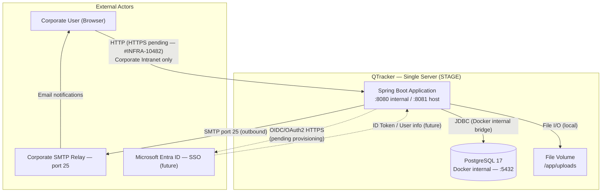
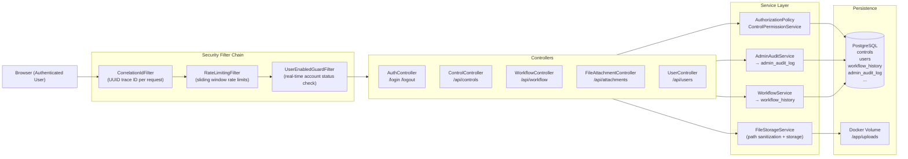

# QTracker — Security Assessment Report
## Document 02: Infrastructure, Logging, Encryption & Data Flow
### Sections: 4 (Infrastructure), 9 (Logging & Audit), 11 (Encryption)

**Document Version:** 1.0
**Prepared for Environment:** STAGE
**Date:** 2026-07-24
**Classification:** INTERNAL — RESTRICTED

---

## 1. Data Encryption Policy

### 1.1 Encryption In Transit (HTTPS / TLS) — Status: Pending Infrastructure Provisioning

*Physical evidence supporting this section: **ART-16** (Jira ticket #INFRA-10482 screenshot) — see Document 03, Appendix A.*

The application codebase is fully prepared for HTTPS. `SecurityConfig.java` pre-configures `Strict-Transport-Security` headers (`max-age=31536000; includeSubDomains`). The `.env.example` configuration template specifies `APP_BASE_URL=https://<app-hostname>`, confirming the production-intended URL scheme.

A formal request for an SSL/TLS certificate and IdP (SSO) parameters has been submitted to the IT Infrastructure team (Jira Ticket: #INFRA-10482 — Pending Provisioning). HTTPS and SSO activation require no source code changes; configuration is applied at the reverse-proxy / Docker host layer by supplying the certificate and environment variables.

**Compensating control for STAGE:** The STAGE server is deployed within a closed corporate intranet perimeter. The application is not accessible from the public internet. Network-level isolation mitigates the interception risk that HTTPS addresses for public-facing services. The STAGE environment does not process production data.

| Item | Status | Evidence |
|---|---|---|
| TLS code readiness | Confirmed | HSTS headers pre-configured in `SecurityConfig.java` |
| SSL certificate provisioned | Pending | Jira Ticket: #INFRA-10482 |
| IdP (SSO / OIDC) parameters provisioned | Pending | Jira Ticket: #INFRA-10482 |
| STAGE accessible from public internet | No | Closed corporate perimeter |
| SSO profile implemented in code | Confirmed | `@Profile("ssodev")` + `securityFilterChainSso` in `SecurityConfig.java` |

---

### 1.2 Encryption At Rest

#### 1.2.1 Database (PostgreSQL 17)

| Item | Status | Notes |
|---|---|---|
| Database-level encryption | Infrastructure-managed | Standard PostgreSQL 17 on Docker named volume (`qtracker_pgdata`). Transparent disk encryption is an infrastructure-level configuration responsibility |
| Password storage | BCrypt hash only | `users.password` stores BCrypt(10) hash exclusively. Plaintext passwords are never written to the database |
| Sensitive columns | No high-sensitivity PII beyond business email and display name | `users` table stores: `id`, `role`, `displayName`, `mail`, `entraOid`, `enabled`, `adminAccess`, `password` (hash), `createdAt`, `lastLoginAt` |

#### 1.2.2 File Storage

Uploaded attachments are stored on the local file system under the Docker named volume `qtracker_uploads`, mounted to the path configured by the `FILE_UPLOAD_DIR` environment variable (default: `/app/uploads`).

| Item | Status |
|---|---|
| At-rest file encryption | Infrastructure-level responsibility |
| Path traversal protection | Enforced by application (`FileStorageService` sanitization) |
| Access control | Authentication and `ControlPermission` check required for all download and view endpoints |

---

### 1.3 Local Database Connection — Single-Server Setup

The Spring Boot application and PostgreSQL 17 database run on the same host within a single Docker Compose stack. All JDBC traffic between the application container and the database container travels exclusively over Docker's internal bridge network. The PostgreSQL port `5432` is not mapped to the host interface in the production `docker-compose.yml`.

**Evidence from `docker-compose.yml`:**

*Physical evidence supporting this section: **ART-11** (`docker compose config` + `docker compose ps` output) — see Document 03, Appendix A.*

```yaml
services:
  db:
    image: postgres:17
    # No "ports:" mapping — PostgreSQL is not accessible from the host or external network
    volumes:
      - qtracker_pgdata:/var/lib/postgresql/data

  app:
    depends_on:
      db:
        condition: service_healthy
    ports:
      - "${APP_PORT:-8081}:8080"   # Only the application port is exposed on the host
```

The `docker-compose.dev.yml` override adds `ports: - "5432:5432"` for DEV developer convenience only. This override is not applied on STAGE. On STAGE, only `docker-compose.yml` is used, keeping the database fully internal.

The JDBC connection string is configured via the `SPRING_DATASOURCE_URL` environment variable, resolving the database via the Docker internal service name `db`:

```
jdbc:postgresql://db:5432/QTracker
```

This hostname resolves only within the Docker bridge network and is not reachable from outside the host. Since all JDBC traffic is confined to Docker's internal network (functionally equivalent to loopback), network-level interception of database credentials or query data from outside the host is not possible.

---

### 1.4 Secret Management — Environment Variables

All sensitive configuration parameters are passed to the application exclusively via environment variables following the 12-Factor App model. The `.gitignore` file excludes `.env` files from version control. The `.env.example` file committed to the repository contains only placeholder values and no real credentials.

| Secret | Delivery Method |
|---|---|
| `SPRING_DATASOURCE_PASSWORD` | `.env` file → Docker `env_file` directive → OS environment |
| `POSTGRES_PASSWORD` | `.env` file → Docker `env_file` directive → OS environment |
| `SPRING_MAIL_PASSWORD` | Environment variable (not active — SMTP relay operates without authentication) |
| SSO Client Secret (future) | Will be supplied via `.env` from IT Infrastructure provisioning (Jira: #INFRA-10482) |
| JWT Signing Key | Not applicable — application uses server-side HTTP sessions; no JWT signing key is required |

---

## 2. Logging & Audit

### 2.1 Logging Framework

*Physical evidence supporting this section: **ART-14** (application log samples with UUID correlationId, admin_audit_log rows, workflow_history rows) and **ART-15** (SIEM / log retention statement) — see Document 03, Appendix A.*

| Property | Value |
|---|---|
| API | SLF4J 2.x |
| Implementation | Logback (Spring Boot default, embedded in `spring-boot-starter-web`) |
| Log format | Timestamp — level — logger name — correlationId (MDC) — message |
| MDC context | `correlationId` UUID injected per request by `CorrelationIdFilter`, propagated to all log statements within the request thread |
| Log destinations | Console (`stdout`) captured by Docker logging driver |
| Default log level | INFO (Spring Boot default); DEBUG for `com.kpmg.qtracker` package |

`CorrelationIdFilter` ensures every HTTP request carries a unique trace identifier throughout the request lifecycle:

```java
String correlationId = UUID.randomUUID().toString();
MDC.put("correlationId", correlationId);
response.setHeader("X-Correlation-Id", correlationId);
```

This identifier is returned in the `X-Correlation-Id` response header and is present in every log line generated during the request, enabling full log correlation in aggregated log storage.

### 2.2 Persistent Structured Audit Log (Database)

QTracker maintains a tamper-evident audit trail in the `admin_audit_log` PostgreSQL table via `AdminAuditService`.

**Table schema (`AdminAuditLog` entity):**

| Column | Type | Description |
|---|---|---|
| `id` | `BIGINT` PK | Auto-generated surrogate key |
| `admin_email` | `VARCHAR` NOT NULL | Email address of the acting user |
| `admin_name` | `VARCHAR` | Display name of the acting user |
| `action_type` | `VARCHAR(50)` NOT NULL | Event type code (see section 2.3) |
| `control_id` | `BIGINT` | Database ID of the affected control (nullable for non-control events) |
| `control_control_id` | `VARCHAR(100)` | Business control ID (e.g. `CTRL-HR-001`) |
| `action_description` | `TEXT` | Human-readable description of the action |
| `changed_fields` | `TEXT` (JSON) | JSON array of field names that changed |
| `previous_values` | `TEXT` (JSON) | JSON object of field values before the change |
| `new_values` | `TEXT` (JSON) | JSON object of field values after the change |
| `created_at` | `TIMESTAMP` | Event timestamp — auto-set on insert by `@PrePersist` |
| `ip_address` | `VARCHAR(45)` | Client IP address (IPv4/IPv6 capable) |
| `user_agent` | `VARCHAR(500)` | HTTP `User-Agent` string |

### 2.3 Logged Security and Business Events

| Event Category | Action Type / Log Pattern | Storage |
|---|---|---|
| Successful login | `auth status=SUCCESS` | Application log |
| Failed login — bad credentials | `auth status=BAD_CREDENTIALS` | Application log |
| Account locked — brute-force threshold | `auth status=LOCKED` | Application log |
| Account disabled | `auth status=DISABLED` | Application log |
| Last login timestamp recorded | — | `users.last_login_at` (database) |
| Workflow action denied (403) | HTTP 403 response logged | Application log |
| User created | `USER_CREATE` | `admin_audit_log` |
| User role / access updated | `USER_ACCESS_UPDATE` | `admin_audit_log` |
| User email changed | `USER_EMAIL_UPDATE` | `admin_audit_log` |
| Control fields edited | `EDIT` (with field-level diff) | `admin_audit_log` |
| Control deleted | — | `admin_audit_log` |
| Workflow action performed | INFO log + `workflow_history` entry | Application log + database |
| Workflow step approved | `WorkflowActionType.APPROVE` | `workflow_history` table |
| Workflow step returned | `WorkflowActionType.RETURN` | `workflow_history` table |
| Control completed | `WorkflowActionType.APPROVE` (COMPLETED) | `workflow_history` table |
| File uploaded | `ATTACHMENT_ADDED` | `admin_audit_log` |
| File deleted | `ATTACHMENT_REMOVED` | `admin_audit_log` |
| Excel export triggered | INFO log | Application log |
| Rate limit exceeded | HTTP 429 response | Application log |
| Unhandled exceptions | ERROR log | Application log (`GlobalExceptionHandler`) |

### 2.4 Workflow History

All workflow state transitions are persisted in the `workflow_history` table (entity: `WorkflowHistory`) with the following fields per entry:

- `control_id` — foreign key to the `controls` table
- `action_type` — `WorkflowActionType` enum value (INITIATE, SUBMIT_TO_OPERATOR, SUBMIT_TO_SOQM_TEAM, RETURN_TO_OPERATOR, SUBMIT_TO_PROCESS_OWNER, APPROVE, RETURN, REJECT, COMMENT, REASSIGN)
- `from_step` / `to_step` — workflow status strings before and after the transition
- `performed_by_email` / `performed_by_name` — acting user identity
- `comments` — optional reviewer comment attached to the transition
- `created_at` — transition timestamp

This provides a complete, ordered history of every state change for every control in the system.

### 2.5 Log Retention

Application logs written to `stdout` are captured by Docker's default JSON-file logging driver on the host. Formal log retention policy and forwarding to a central SIEM are infrastructure configuration items to be completed prior to Production go-live (see Document 03, Section 15, Item #8 and **ART-15**).

---

## 3. Network Flow & Data Flow Diagram

### 3.1 Network Architecture

*Physical evidence supporting this section: **ART-12** (firewall / network isolation log), **ART-17** (DFD Level 0 and Level 1 exported as PNG/PDF) — see Document 03, Appendix A.*

All components (Spring Boot application and PostgreSQL 17) reside on a single host running Docker Compose. The application and database communicate over the Docker internal bridge network. The PostgreSQL port is not exposed externally in the STAGE configuration.

**Inbound access:** Corporate network users access the application on the host's internal network address, port `8081` (HTTP). No public internet access path exists. The host is behind the corporate firewall.

**Outbound access:** Email notifications are sent via the corporate SMTP relay on port 25 (internal network, no SMTP authentication). Microsoft Entra ID OIDC traffic (HTTPS outbound to `login.microsoftonline.com`) will be activated when the `ssodev` profile is provisioned.

### 3.2 Data Flow Diagram — Level 0 (Context)



### 3.3 Data Flow Diagram — Level 1 (Application Internals)



### 3.4 Sensitive Data Map

| Data Element | Source | Destination | Transport | Storage |
|---|---|---|---|---|
| User credentials (password) | Browser login form | Spring Security filter — discarded after auth | HTTP (HTTPS pending) | BCrypt hash in `users.password` |
| Session cookie (`JSESSIONID`) | Tomcat | Browser | HTTP `Set-Cookie` | Server-side in-memory session store |
| Control data (business fields) | Browser / AJAX | Controllers → PostgreSQL | HTTP (intranet) | `controls` table |
| Attachment files | Browser multipart upload | `FileStorageService` → Docker volume | HTTP multipart (intranet) | `/app/uploads` (local filesystem) |
| User email / display name | Browser / Admin form | PostgreSQL | HTTP (intranet) | `users` table |
| Entra OID (future SSO) | Microsoft Entra ID | PostgreSQL | HTTPS (OIDC) | `users.entra_oid` (non-secret identifier) |
| Notification email content | Application | Corporate SMTP relay | SMTP port 25 (internal) | Not persisted |
| Audit log entries | Application | PostgreSQL | JDBC (Docker internal) | `admin_audit_log` table |
| Correlation ID | `CorrelationIdFilter` | Response header + log stream | HTTP header | Docker log storage (`stdout`) |
